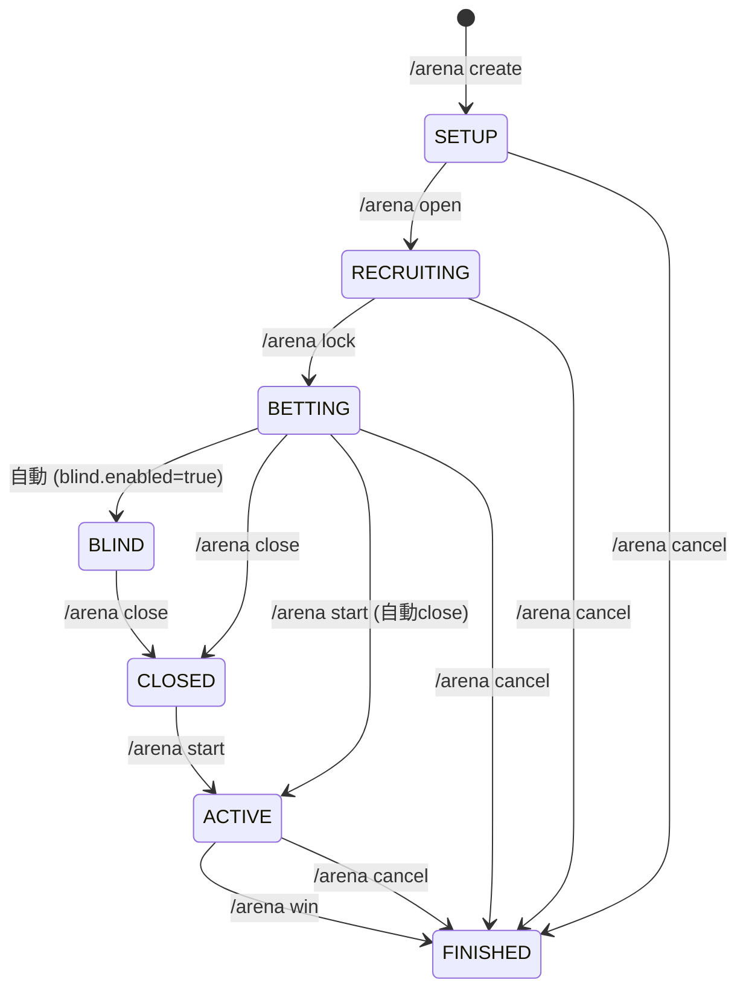
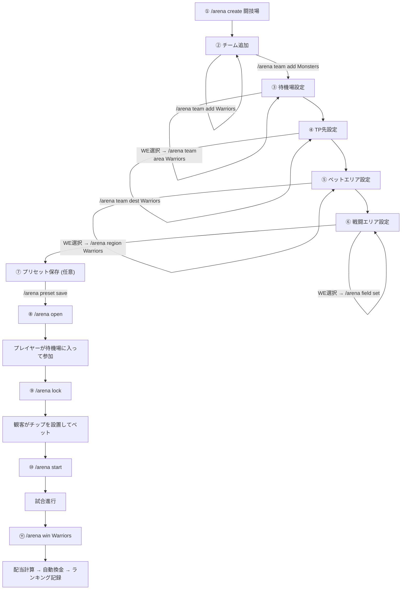
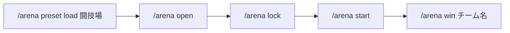
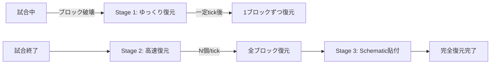

# Colosseum (コロシアム)

Colosseum は、Minecraft サーバー内で手軽にカジノや闘技場のベッティングを楽しめるように開発された、プラグインの詰め合わせ（スイート）です。

ゲーム内アイテムである「カーペット」を物理的なカジノチップに見立てて、プレイヤー同士で遊べるユニークなシステムを提供しています。

> プレイヤー向けの遊び方は [プレイヤーガイド](docs/PLAYER_GUIDE.md) を参照。この README は運営・開発者向け。

---

## プロジェクトの構成

このプロジェクトは、役割ごとに以下の 3 つのモジュールに分かれています。

*   **ChipLib** (v2.0.1)
    チップ管理の基盤となるプラグインです。`/chip` コマンドによるチップの購入・換金・残高確認と、`/ranking` コマンドによるカテゴリ別ランキング（カジノ / アリーナ / 総合）を提供します。アドベンチャーモードのプレイヤーでもカーペットを設置できるよう、CanPlaceOn NBT タグを自動付与します。
*   **CasinoCore** (v3.0.0)
    サーバー全体でのカジノイベントを管理するコアプラグインです。カジノモードを開始すると、参加プレイヤーを一時的にアドベンチャーモードにし、カーペット回収用のハサミ（カジノシザース）を配って、不正を防ぎながら遊べる環境を整えます。データの保存処理は非同期で行われるため、サーバーの動作も軽量です。
*   **ArenaCore** (v3.2.0)
    闘技場でのベッティングを行うためのプラグインです。プレイヤーは、あらかじめ設定されたエリアに物理的にチップ（カーペット）を置くことで、好きなチームにベットできます。**複数のチームに同時にベットすることも可能**です。パリミュチュエル方式（天引き分配）による配当計算、デスマッチモード、ブラインドフェーズ、ジャックポットシステムを搭載。勝者宣言後は全プレイヤーのチップが自動換金され、アリーナランキングに記録されます。

### 依存関係

```
ChipLib（プラグイン） ← CasinoCore ← ArenaCore
```

---

## アリーナ運営フロー

### セッション状態遷移図



### 運営手順フロー



### クイックスタート（プリセット使用時）



---

## チップと額面のルール

チップ（カーペット）の色ごとに額面（E 単位）が決まっています。

| 色 | マテリアル | 額面 |
|---|----------|------|
| 茶色 | BROWN_CARPET | 1 E |
| 紫色 | PURPLE_CARPET | 5 E |
| 青色 | BLUE_CARPET | 10 E |
| 水色 | LIGHT_BLUE_CARPET | 50 E |
| 浅葱色 | MAGENTA_CARPET | 100 E |
| 緑色 | GREEN_CARPET | 500 E |
| 黄緑色 | LIME_CARPET | 1,000 E |
| 黄色 | YELLOW_CARPET | 5,000 E |
| 橙色 | ORANGE_CARPET | 10,000 E |
| 桃色 | PINK_CARPET | 50,000 E |
| 赤色 | RED_CARPET | 100,000 E |
| 白色 | WHITE_CARPET | 500,000 E |
| 黒色 | BLACK_CARPET | 1,000,000 E |

---

## 全コマンド一覧

### チップの売買（ChipLib 提供）

| コマンド | 説明 |
|---------|------|
| `/chip <額面> <枚数>` | 指定チップを指定枚数購入 |
| `/chip <金額>` | 最適な組み合わせで自動分割購入 |
| `/chip info` | チップの額面と色の対応表を表示 |
| `/chip balance` | 手持ちチップの内訳と合計額を表示 |
| `/chip cashout` | 手持ちチップをすべて換金 |

> **⚠ 購入制限**: チップの購入はカジノモード中、またはアリーナのベット受付中のみ可能です。`info` / `balance` / `cashout` はいつでも使えます。

> **💡 アドベンチャーモード強制**: チップ購入時にアドベンチャーモードに自動切替、換金時に元のモードに復元されます。

### ランキング（ChipLib 提供）

| コマンド | 説明 |
|---------|------|
| `/ranking` | 総合ランキング（カジノ + アリーナの合計損益） |
| `/ranking casino` | カジノランキング |
| `/ranking arena` | アリーナランキング |
| `/ranking reset <casino\|arena\|all>` | ランキングリセット（OP権限） |

### カジノの管理（CasinoCore 提供）

| コマンド | 説明 |
|---------|------|
| `/casino on` | カジノ開始（全体） |
| `/casino on <プレイヤー>` | 個別プレイヤーをカジノに追加 |
| `/casino off` | カジノ終了（自動換金・ゲームモード復元） |
| `/casino off <プレイヤー>` | 個別プレイヤーをカジノから退出 |
| `/casino status` | カジノの稼働状態を表示 |
| `/casino ranking` | カジノ損益ランキング表示 |
| `/casino stats [プレイヤー]` | プレイヤー詳細統計 |

### 闘技場の運営（ArenaCore 提供）

#### セッション管理

| コマンド | 説明 | 必要状態 |
|---------|------|---------|
| `/arena create <名前>` | セッションを新規作成 | なし |
| `/arena open [秒数]` | 参加者募集開始（秒数指定で自動ロック） | SETUP |
| `/arena lock [秒数]` | 参加者確定 & ベット受付開始（秒数指定で自動締切） | RECRUITING |
| `/arena close` | ベット締切（試合は開始しない） | BETTING / BLIND |
| `/arena start` | 試合開始（ベットを自動締切） | BETTING / BLIND / CLOSED |
| `/arena win <チーム名>` | 勝者宣言 → 配当処理 | ACTIVE |
| `/arena cancel` | セッション中止（全額返金） | 全状態 |
| `/arena status` | 現在のセッション状態を表示 | 全状態 |

#### チーム管理

| コマンド | 説明 | 必要状態 |
|---------|------|---------|
| `/arena team add <チーム名>` | チームを追加 | SETUP |
| `/arena team remove <チーム名>` | チームを削除（関連設定も全除去） | SETUP |
| `/arena team list` | チーム一覧を表示 | 全状態 |
| `/arena team area <チーム> [待機場名]` | WE選択範囲を待機場に設定 | SETUP |
| `/arena team dest <チーム>` | 現在地をTP先に設定 | SETUP |
| `/arena team color <チーム> <色>` | チームカラーを設定 | SETUP |

#### エリア・フィールド設定

| コマンド | 説明 | 必要状態 |
|---------|------|---------|
| `/arena region <チーム名>` | WE選択範囲をベットエリアに設定 | SETUP |
| `/arena field set [名前]` | WE選択範囲を戦闘エリアに設定 | SETUP |
| `/arena field info` | 戦闘エリア情報を表示 | 全状態 |

#### プリセット

| コマンド | 説明 |
|---------|------|
| `/arena preset save [名前]` | 全設定をプリセット保存 |
| `/arena preset load <名前>` | プリセットからセッション復元 |
| `/arena preset list` | プリセット一覧 |
| `/arena preset delete <名前>` | プリセット削除 |

#### デスマッチ（闘技者専用）

| コマンド | 説明 |
|---------|------|
| `/arena deathmatch <参加費>` | デスマッチを提案（闘技者投票制） |
| `/arena deathmatch yes` | デスマッチ提案に賛成 |
| `/arena deathmatch no` | デスマッチ提案に反対 |
| `/arena deathmatch cancel` | デスマッチ提案をキャンセル（提案者のみ） |
| `/arena deathmatch info` | 現在のデスマッチ状態を表示 |

#### 観客用ベットコマンド

| コマンド | 説明 |
|---------|------|
| `/bet <チーム> <金額>` | コマンドからベット（エリア設置の代替） |
| `/bet odds` | 各チームの現在のオッズ・プール総額を表示 |
| `/bet info` | 自分のベット状況・予想配当を表示 |

---

## 待機場システム

プレイヤーの参加・離脱は面倒なコマンド操作不要で、すべて自動です。

*   **自動参加/離脱**: 待機場エリアに入ると即座にチームに追加され、出ると削除されます。
*   **TABリスト連携**: チーム参加と同時に Minecraft のバニラ Scoreboard Team に自動登録されるため、TABキーのプレイヤーリストにチームカラー付きで表示されます。味方討ち（Friendly Fire）も自動で無効になります。
*   **サーバー参加時チェック**: サーバーにログインした瞬間に待機場エリア内にいた場合、自動的にチームに参加します。
*   **チームカラー同期**: `/arena team color <チーム名> <色>` でチームカラーを変更すると、Scoreboard Team の色も即座に反映されます。

---

## 通知・演出システム

### アクションバー残高表示

カジノ / アリーナでの収支変動時に、アクションバーにシャッフルアニメーション付きで残高変動を表示します。

```
💰💰 12,500 E +1#,%!&    ← シャッフル中（ランダム文字）
💰💰 12,500 E +10,%!&    ← 左端から確定
💰💰 12,500 E +10,000    ← 全確定 → 緑BOLD表示
```

### サブタイトル演出

*   **ベット設置時**: チーム名（チーム色BOLD）+ 額面（サブタイトル）
*   **ベット回収時**: `↩ BET CANCEL` + 回収額（サブタイトル）
*   **配当計算**: 計算式をステップごとにサブタイトルで表示
*   **没収演出**: `💀 CONFISCATED` シーケンス

---

## 地形復元システム

ArenaCore には、試合中に破壊されたブロックを自動で元に戻す **3段階の地形復元システム** が搭載されています。



### クラッシュ復旧

試合中にサーバーがクラッシュした場合に備え、`.active` マーカーファイルを使った自動復旧機構があります。

*   試合開始時に `.active` ファイルが作成され、正常終了時に削除されます。
*   サーバー再起動時にこのファイルが残っていた場合、自動的に Schematic ペーストで地形を復旧します。

---

## セッション管理の内部構造

各 ArenaSession は **UUID（内部ID）** と **表示名（DisplayName）** の2つの識別子で管理されます。

| 用途 | 識別子 | 例 |
|------|--------|-----|
| WorldGuard リージョンID | UUID | `arenacore_field_a1b2c3d4-...` |
| Schematic ファイル名 | UUID | `a1b2c3d4-....schem` |
| TerrainManager 追跡 | UUID | `a1b2c3d4-...` |
| チャット表示 | 表示名 | `闘技場「闘技場」` |
| ログ出力 | 表示名 | `闘技場` |
| プリセット名 | 表示名 / ユーザー指定 | `闘技場` |

> **💡 日本語対応**: 表示名には日本語が使えます。内部では UUID で管理されるため、WorldGuard 等のASCII制限に影響されません。

---

## プレイヤーの接続管理

途中ログイン・ログアウト・キックに対して、全モジュールで安全なクリーンアップ処理が行われます。

| イベント | ChipLib | CasinoCore | ArenaCore |
|---------|---------|------------|-----------|
| **ログアウト** | チップ自動換金・ゲームモード復元 | カジノ状態クリーンアップ | チーム離脱 or 戦闘員死亡扱い |
| **キック** | 同上 | 同上 | 同上 |
| **途中ログイン** | — | カジノ参加案内メッセージ | ベット受付中ならチップ購入許可、待機場エリア内なら自動チーム参加 |

---

## システム設定について

### チップの設定 (plugins/ChipLib/config.yml)

*   `max-buy`: 一度に購入できるチップの最大合計額（デフォルト: 1,000,000）

### カジノの設定 (plugins/CasinoCore/config.yml)

*   `max-buy`: 一度に購入できるチップの最大合計額（デフォルト: 1,000,000）
*   `ranking-size`: ランキングに表示するプレイヤー数（デフォルト: 10）

### 闘技場の設定 (plugins/ArenaCore/config.yml)

| 設定キー | 説明 | デフォルト |
|---------|------|-----------|
| `win-condition` | 勝利判定: `last-team-standing` / `manual` / `score` | `last-team-standing` |
| `entry-fee` | 戦闘員の参加費 | `0` |
| `distribution.loser-fighter-share` | 敗者闘技者への還元率 | `0.01` (1%) |
| `distribution.winner-fighter-share` | 勝者闘技者への還元率 | `0.10` (10%) |
| `distribution.house-fee` | 運営手数料 → ジャックポット積立 | `0.05` (5%) |
| `fighter-guarantee` | 闘技者の最低保証金 | `100` |
| `jackpot.enabled` | ジャックポットの有効/無効 | `true` |
| `blind.enabled` | ブラインドフェーズの有効/無効 | `false` |
| `deathmatch.max-proposals` | デスマッチの最大提案回数 | `2` |
| `odds-broadcast-interval` | ベット中のオッズ通知間隔（秒） | `30` |

### 地形復元の設定 (plugins/ArenaCore/config.yml)

| 設定キー | 説明 | デフォルト |
|---------|------|-----------|
| `terrain-restore.enabled` | 地形復元の有効/無効 | `true` |
| `terrain-restore.during-match-delay` | 試合中の復元遅延tick数 | `300` (15秒) |
| `terrain-restore.post-match-delay` | 試合後の復元開始遅延tick数 | `60` (3秒) |
| `terrain-restore.post-match-blocks-per-tick` | 試合後の復元ブロック数/tick | `10` |
| `terrain-restore.effects` | 復元エフェクトの有効/無効 | `true` |

---

## 動作に必要なもの

*   Minecraft: 1.20.1 以上
*   Java: Java 17 以上
*   前提プラグイン:
    *   [Vault](https://github.com/MilkBowl/Vault)
    *   Vault に対応した経済プラグイン（EmeraldBank など）
*   おすすめプラグイン:
    *   [WorldEdit](https://dev.bukkit.org/projects/worldedit) （アリーナのエリア設定・地形復元に必要です）
    *   [WorldGuard](https://dev.bukkit.org/projects/worldguard) （アリーナフィールドのプレイヤー侵入制限に使用）

---

## 開発とビルド

プロジェクトのルートディレクトリで以下の Gradle コマンドを実行して、ビルドやテストを行うことができます。

```bash
# 全プラグインのビルド（Fat JAR 生成）
./gradlew shadowJar

# 全モジュールのテスト実行
./gradlew test

# クリーンビルド（キャッシュ問題解消）
./gradlew clean shadowJar --no-build-cache

# 特定モジュールのビルド
./gradlew :ArenaCore:shadowJar
./gradlew :CasinoCore:shadowJar
./gradlew :ChipLib:shadowJar
```

ビルドが成功すると、それぞれのモジュールの `build/libs/` フォルダ内に導入用の jar ファイルが作成されます。

*   `ChipLib/build/libs/ChipLib-2.0.1.jar`
*   `CasinoCore/build/libs/CasinoCore-3.0.0.jar`
*   `ArenaCore/build/libs/ArenaCore-3.2.0.jar`

> **⚠ デプロイ時の注意**: jarファイルをサーバーの `plugins/` に配置した後は、**サーバーの完全再起動**（`stop` → 起動）が必要です。`/reload` ではクラスローダーが更新されず、`ClassNotFoundException` が発生する場合があります。
